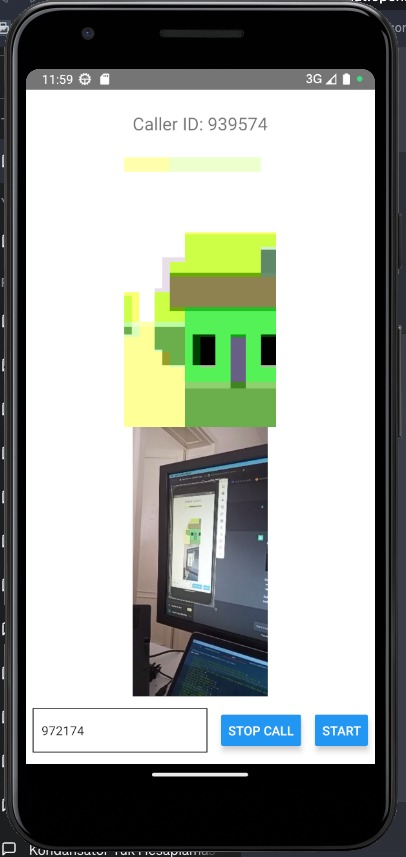
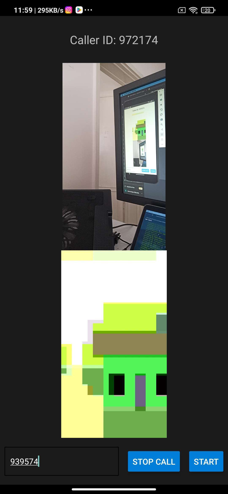

<!DOCTYPE html>
<html>
<head>
  <title>React Native WebRTC App</title>
</head>
<body>
  <h1>React Native WebRTC App</h1>

  
This is a React Native app that enables users to make video calls with others on the local network using WebRTC.

  <h2>Features</h2>
  <ul>
    <li>Make video calls with other users on the local network.</li>
    <li>Supports real-time video streaming using WebRTC technology.</li>
  </ul>

  <h2>Prerequisites</h2>
  
Before running the app, ensure that you have the following prerequisites:

  <ul>
    <li>Node.js (v12 or above)</li>
    <li>React Native CLI</li>
    <li>Xcode (for iOS development)</li>
    <li>Android Studio (for Android development)</li>
  </ul>

  <h2>Installation</h2>
  <ol>
    <li>Clone the repository: 
      <code>git clone &lt;repository_url&gt;</code></li>
    <li>Navigate to the project directory: 
      <code>cd react-native-webrtc-app</code></li>
    <li>Install the dependencies: 
      <code>npm install</code></li>
  </ol>

  <h2>Usage</h2>
  <ol>
    <li>Start the development server: 
      <code>npm start</code></li>
    <li>Run the app on iOS or Android: 
      <code>npx react-native run-ios</code> (for iOS) 
      <code>npx react-native run-android</code> (for Android)</li>
  </ol>

  <h2>Screenshots</h2>
  <!-- Add screenshots or preview images of the app here -->
  
  

  <h2>Contributing</h2>
  
Contributions are welcome! If you encounter any issues or have suggestions, please open an issue or submit a pull request.

  <h2>License</h2>
  
<a href="LICENSE">MIT License</a>

</body>
</html>
